Final Econometrics Project
================
by Tamires Amorim
12/12/2020

## Racial Wage Gap: Analysis of difference in wages between black and white Americans

The present analysis aims to observe how much of the difference in wages
between white and blacks in the United States can be explained by their
differences in observed attributes as educational attainments and
community attributes.

The data extracted comes from the IPUMS/CPS database. Courtesy of Sarah
Flood, Miriam King, Renae Rodgers, Steven Ruggles and J. Robert Warren.
Integrated Public Use Microdata Series, Current Population Survey:
Version 8.0 \[dataset\]. Minneapolis, MN: IPUMS, 2020.
<https://doi.org/10.18128/D030.V8.0>

Installing necessary packages:

The data was collected from (<https://cps.ipums.org/>). The selection of
the variables were based on the requirements of the question in
analysis. Importing the data from local directory below:

Summary of the data:

``` r
glimpse(data)
```

    ## Rows: 1,130,166
    ## Columns: 19
    ## $ YEAR     <dbl> 2014, 2014, 2014, 2014, 2014, 2014, 2014, 2014, 2014, 2014...
    ## $ REGION   <int+lbl> 11, 11, 11, 11, 11, 11, 11, 11, 11, 11, 11, 11, 11, 11...
    ## $ METRO    <int+lbl> 1, 1, 1, 1, 1, 1, 1, 1, 1, 1, 1, 1, 1, 1, 1, 1, 1, 1, ...
    ## $ AGE      <int+lbl> 73, 72, 34, 8, 2, 41, 16, 43, 67, 70, 66, 47, 55, 38, ...
    ## $ SEX      <int+lbl> 1, 2, 2, 2, 2, 2, 2, 1, 1, 1, 2, 1, 2, 2, 1, 2, 1, 2, ...
    ## $ RACE     <int+lbl> 100, 100, 100, 100, 100, 100, 100, 100, 100, 100, 100,...
    ## $ MARST    <int+lbl> 1, 1, 2, 6, 6, 5, 6, 4, 4, 1, 1, 1, 1, 1, 1, 6, 6, 6, ...
    ## $ LABFORCE <int+lbl> 2, 2, 2, 0, 0, 2, 2, 2, 1, 1, 1, 2, 2, 2, 2, 0, 2, 0, ...
    ## $ OCC2010  <int+lbl> 430, 420, 2010, 9920, 9920, 4510, 4130, 500, 9920, 992...
    ## $ CLASSWKR <int+lbl> 27, 21, 21, 0, 0, 13, 21, 21, 0, 0, 0, 21, 21, 14, 14,...
    ## $ EDUC     <int+lbl> 124, 111, 111, 1, 1, 81, 40, 73, 73, 60, 73, 111, 73, ...
    ## $ EARNWT   <dbl> 0.00, 0.00, 0.00, 0.00, 0.00, 2835.80, 0.00, 3052.00, 0.00...
    ## $ WKSWORK2 <int+lbl> 6, 6, 6, 0, 0, 5, 2, 6, 0, 0, 0, 6, 6, 6, 6, 0, 6, 0, ...
    ## $ FULLPART <int+lbl> 1, 1, 1, 0, 0, 1, 2, 1, 0, 0, 0, 1, 1, 1, 1, 0, 1, 0, ...
    ## $ INCTOT   <dbl+lbl>    101500,     77300,     29003, 999999999, 999999999,...
    ## $ INCWAGE  <dbl+lbl> 1.5e+04, 4.2e+04, 2.9e+04, 1.0e+08, 1.0e+08, 0.0e+00, ...
    ## $ HOURWAGE <dbl+lbl> 999.99, 999.99, 999.99, 999.99, 999.99, 999.99,   7.25...
    ## $ PAIDHOUR <int+lbl> 0, 0, 0, 0, 0, 0, 2, 2, 0, 0, 0, 0, 0, 0, 0, 0, 0, 0, ...
    ## $ EARNWEEK <dbl+lbl> 9999.99, 9999.99, 9999.99, 9999.99, 9999.99, 9999.99, ...

``` r
dim(data)
```

    ## [1] 1130166      19

``` r
summary(data)
```

    ##       YEAR          REGION         METRO            AGE             SEX       
    ##  Min.   :2014   Min.   :11.0   Min.   :0.000   Min.   : 0.00   Min.   :1.000  
    ##  1st Qu.:2015   1st Qu.:21.0   1st Qu.:2.000   1st Qu.:16.00   1st Qu.:1.000  
    ##  Median :2016   Median :31.0   Median :3.000   Median :36.00   Median :2.000  
    ##  Mean   :2016   Mean   :29.3   Mean   :2.512   Mean   :36.45   Mean   :1.515  
    ##  3rd Qu.:2018   3rd Qu.:41.0   3rd Qu.:3.000   3rd Qu.:54.00   3rd Qu.:2.000  
    ##  Max.   :2019   Max.   :42.0   Max.   :4.000   Max.   :85.00   Max.   :2.000  
    ##       RACE           MARST          LABFORCE        OCC2010        CLASSWKR    
    ##  Min.   :100.0   Min.   :1.000   Min.   :0.000   Min.   :  10   Min.   : 0.00  
    ##  1st Qu.:100.0   1st Qu.:1.000   1st Qu.:1.000   1st Qu.:4230   1st Qu.: 0.00  
    ##  Median :100.0   Median :5.000   Median :1.000   Median :9920   Median : 0.00  
    ##  Mean   :169.6   Mean   :3.747   Mean   :1.258   Mean   :7104   Mean   :10.39  
    ##  3rd Qu.:100.0   3rd Qu.:6.000   3rd Qu.:2.000   3rd Qu.:9920   3rd Qu.:21.00  
    ##  Max.   :830.0   Max.   :6.000   Max.   :2.000   Max.   :9920   Max.   :29.00  
    ##       EDUC            EARNWT         WKSWORK2        FULLPART     
    ##  Min.   :  1.00   Min.   :    0   Min.   :0.000   Min.   :0.0000  
    ##  1st Qu.: 30.00   1st Qu.:    0   1st Qu.:0.000   1st Qu.:0.0000  
    ##  Median : 73.00   Median :    0   Median :0.000   Median :0.0000  
    ##  Mean   : 64.91   Mean   : 1298   Mean   :2.646   Mean   :0.5982  
    ##  3rd Qu.: 92.00   3rd Qu.:    0   3rd Qu.:6.000   3rd Qu.:1.0000  
    ##  Max.   :125.00   Max.   :85013   Max.   :6.000   Max.   :2.0000  
    ##      INCTOT             INCWAGE            HOURWAGE         PAIDHOUR     
    ##  Min.   :   -16458   Min.   :       0   Min.   :   1.0   Min.   :0.0000  
    ##  1st Qu.:    12023   1st Qu.:       0   1st Qu.:1000.0   1st Qu.:0.0000  
    ##  Median :    38002   Median :   30000   Median :1000.0   Median :0.0000  
    ##  Mean   :223155546   Mean   :22336039   Mean   : 961.2   Mean   :0.1654  
    ##  3rd Qu.:   146578   3rd Qu.:  125000   3rd Qu.:1000.0   3rd Qu.:0.0000  
    ##  Max.   :999999999   Max.   :99999999   Max.   :1000.0   Max.   :2.0000  
    ##     EARNWEEK    
    ##  Min.   :    1  
    ##  1st Qu.:10000  
    ##  Median :10000  
    ##  Mean   : 9380  
    ##  3rd Qu.:10000  
    ##  Max.   :10000

Organizing the data for analysis purposes. Follow descriptive categories
according to the IPUMS/CPS code book:

``` r
#individual component:
Age <- as.numeric(data$AGE)
male <- as.numeric(data$SEX == 1)
married <- as.numeric(data$MARST <= 2)
sepdivwid <- as.numeric(data$MARST == 3 | data$MARST == 4 | data$MARST == 5) 
unmarried  <- as.numeric(data$MARST == 6)

#racial component:
White <- as.numeric(data$RACE == 100)
black <- as.numeric(data$RACE == 200)
Amindian <- as.numeric(data$RACE == 300)
Asian <- as.numeric(data$RACE == 650 | data$RACE == 651)
race_oth <- as.numeric(data$RACE >= 830)

#educational attainments:
educ_hs <- as.numeric(data$EDUC == 073)
educ_smcoll <- as.numeric(data$EDUC == 080 | data$EDUC == 081)
educ_as <- as.numeric(data$EDUC == 090 | data$EDUC == 091 | data$EDUC == 092)
educ_bach <- as.numeric(data$EDUC == 100| data$EDUC == 110 | data$EDUC == 111 | data$EDUC == 120 | data$EDUC == 121 | data$EDUC == 122)
educ_adv <- as.numeric(data$EDUC == 123 | data$EDUC == 124| data$EDUC == 125)

#labor force components:
work_fullt <- as.numeric(data$FULLPART == 1)
work_partt <- as.numeric(data$FULLPART == 2)
lbforce <- as.numeric(data$LABFORCE == 2)
work_week <- as.numeric(data$WKSWORK2 == 3)
empl_pvt <- as.numeric(data$CLASSWKR == 21)

#income and wage components:
inc_tot <- data$INCTOT
inc_wage <- data$INCWAGE
hour_wage <- data$HOURWAGE
earn_wk <- data$EARNWEEK

#geographic component:
city <- as.numeric(data$METRO == 2)
REGION <- as.factor(REGION)
levels(REGION) <- c("NORTHEAST REGION", 
                    "New England Division", 
                    "Middle Atlantic Division",
                    "MIDWEST REGION",
                    "East North Central Division",
                    "West North Central Division",
                    "SOUTH REGION",
                    "South Atlantic Division",
                    "East South Central Division",
                    "West South Central Division",
                    "WEST REGION",
                    "Mountain Division",
                    "Pacific Division")
```

Summary to check key components:

``` r
is.factor(REGION)
```

    ## [1] TRUE

``` r
summary(male)
```

    ##    Min. 1st Qu.  Median    Mean 3rd Qu.    Max. 
    ##  0.0000  0.0000  0.0000  0.4853  1.0000  1.0000

Data frame:

``` r
dat_CPS <- data.frame(Age, male, White, black, Amindian, Asian, race_oth, educ_hs, educ_smcoll, educ_as, educ_bach, educ_adv, married, sepdivwid, unmarried, work_fullt, work_partt, lbforce, empl_pvt, work_week, earn_wk, inc_tot, inc_wage, hour_wage, city, REGION)
dim(dat_CPS)
```

    ## [1] 1130166      26

``` r
summary(dat_CPS)
```

    ##       Age             male            White            black       
    ##  Min.   : 0.00   Min.   :0.0000   Min.   :0.0000   Min.   :0.0000  
    ##  1st Qu.:16.00   1st Qu.:0.0000   1st Qu.:1.0000   1st Qu.:0.0000  
    ##  Median :36.00   Median :0.0000   Median :1.0000   Median :0.0000  
    ##  Mean   :36.45   Mean   :0.4853   Mean   :0.7724   Mean   :0.1205  
    ##  3rd Qu.:54.00   3rd Qu.:1.0000   3rd Qu.:1.0000   3rd Qu.:0.0000  
    ##  Max.   :85.00   Max.   :1.0000   Max.   :1.0000   Max.   :1.0000  
    ##                                                                    
    ##     Amindian           Asian            race_oth           educ_hs      
    ##  Min.   :0.00000   Min.   :0.00000   Min.   :0.00e+00   Min.   :0.0000  
    ##  1st Qu.:0.00000   1st Qu.:0.00000   1st Qu.:0.00e+00   1st Qu.:0.0000  
    ##  Median :0.00000   Median :0.00000   Median :0.00e+00   Median :0.0000  
    ##  Mean   :0.01555   Mean   :0.05965   Mean   :9.91e-05   Mean   :0.2119  
    ##  3rd Qu.:0.00000   3rd Qu.:0.00000   3rd Qu.:0.00e+00   3rd Qu.:0.0000  
    ##  Max.   :1.00000   Max.   :1.00000   Max.   :1.00e+00   Max.   :1.0000  
    ##                                                                         
    ##   educ_smcoll        educ_as          educ_bach         educ_adv     
    ##  Min.   :0.0000   Min.   :0.00000   Min.   :0.0000   Min.   :0.0000  
    ##  1st Qu.:0.0000   1st Qu.:0.00000   1st Qu.:0.0000   1st Qu.:0.0000  
    ##  Median :0.0000   Median :0.00000   Median :0.0000   Median :0.0000  
    ##  Mean   :0.1359   Mean   :0.07093   Mean   :0.1413   Mean   :0.0808  
    ##  3rd Qu.:0.0000   3rd Qu.:0.00000   3rd Qu.:0.0000   3rd Qu.:0.0000  
    ##  Max.   :1.0000   Max.   :1.00000   Max.   :1.0000   Max.   :1.0000  
    ##                                                                      
    ##     married         sepdivwid        unmarried       work_fullt    
    ##  Min.   :0.0000   Min.   :0.0000   Min.   :0.000   Min.   :0.0000  
    ##  1st Qu.:0.0000   1st Qu.:0.0000   1st Qu.:0.000   1st Qu.:0.0000  
    ##  Median :0.0000   Median :0.0000   Median :0.000   Median :0.0000  
    ##  Mean   :0.4054   Mean   :0.1316   Mean   :0.463   Mean   :0.3977  
    ##  3rd Qu.:1.0000   3rd Qu.:0.0000   3rd Qu.:1.000   3rd Qu.:1.0000  
    ##  Max.   :1.0000   Max.   :1.0000   Max.   :1.000   Max.   :1.0000  
    ##                                                                    
    ##    work_partt        lbforce          empl_pvt        work_week      
    ##  Min.   :0.0000   Min.   :0.0000   Min.   :0.0000   Min.   :0.00000  
    ##  1st Qu.:0.0000   1st Qu.:0.0000   1st Qu.:0.0000   1st Qu.:0.00000  
    ##  Median :0.0000   Median :0.0000   Median :0.0000   Median :0.00000  
    ##  Mean   :0.1002   Mean   :0.4845   Mean   :0.3685   Mean   :0.02055  
    ##  3rd Qu.:0.0000   3rd Qu.:1.0000   3rd Qu.:1.0000   3rd Qu.:0.00000  
    ##  Max.   :1.0000   Max.   :1.0000   Max.   :1.0000   Max.   :1.00000  
    ##                                                                      
    ##     earn_wk         inc_tot             inc_wage          hour_wage     
    ##  Min.   :    1   Min.   :   -16458   Min.   :       0   Min.   :   1.0  
    ##  1st Qu.:10000   1st Qu.:    12023   1st Qu.:       0   1st Qu.:1000.0  
    ##  Median :10000   Median :    38002   Median :   30000   Median :1000.0  
    ##  Mean   : 9380   Mean   :223155546   Mean   :22336039   Mean   : 961.2  
    ##  3rd Qu.:10000   3rd Qu.:   146578   3rd Qu.:  125000   3rd Qu.:1000.0  
    ##  Max.   :10000   Max.   :999999999   Max.   :99999999   Max.   :1000.0  
    ##                                                                         
    ##       city                                REGION      
    ##  Min.   :0.0000   East North Central Division:206401  
    ##  1st Qu.:0.0000   East South Central Division:182569  
    ##  Median :0.0000   South Atlantic Division    :138561  
    ##  Mean   :0.2544   SOUTH REGION               :129301  
    ##  3rd Qu.:1.0000   Middle Atlantic Division   :118157  
    ##  Max.   :1.0000   MIDWEST REGION             :102675  
    ##                   (Other)                    :252502

## Models

### Linear Regressions

Starting with a simple regression as baseline, before the wage
decomposition models.

#### Model 1:

The group chosen are black workers from 25 to 64 years old, and paid by
the hour worked,the goal is to evaluate the earnings by the week as the
dependent variable, and age, race and educational attainments as
independent variables.

``` r
use_varb <- (Age>=25) & (Age<=64) & (black) & (PAIDHOUR == 2) 
dat_use1<-subset(dat_CPS,use_varb)
dim(dat_use1)
```

    ## [1] 7149   26

``` r
model1<-lm( log(earn_wk) ~ Age + educ_hs + educ_smcoll + educ_as + educ_bach + educ_adv, data=dat_use1) 
summary(model1)
```

    ## 
    ## Call:
    ## lm(formula = log(earn_wk) ~ Age + educ_hs + educ_smcoll + educ_as + 
    ##     educ_bach + educ_adv, data = dat_use1)
    ## 
    ## Residuals:
    ##     Min      1Q  Median      3Q     Max 
    ## -7.6082 -1.3354 -0.5515  1.5964  1.9447 
    ## 
    ## Coefficients:
    ##             Estimate Std. Error t value Pr(>|t|)    
    ## (Intercept) 7.141915   0.095683  74.641  < 2e-16 ***
    ## Age         0.004948   0.001601   3.090  0.00201 ** 
    ## educ_hs     0.194122   0.069889   2.778  0.00549 ** 
    ## educ_smcoll 0.224669   0.073494   3.057  0.00224 ** 
    ## educ_as     0.446698   0.080709   5.535 3.23e-08 ***
    ## educ_bach   0.424221   0.079925   5.308 1.14e-07 ***
    ## educ_adv    0.436456   0.105998   4.118 3.87e-05 ***
    ## ---
    ## Signif. codes:  0 '***' 0.001 '**' 0.01 '*' 0.05 '.' 0.1 ' ' 1
    ## 
    ## Residual standard error: 1.512 on 7142 degrees of freedom
    ## Multiple R-squared:  0.008411,   Adjusted R-squared:  0.007578 
    ## F-statistic:  10.1 on 6 and 7142 DF,  p-value: 3.836e-11

Testing the model, to determine whether there are any statistically
significant differences between the means of the independent variables.

``` r
coeftest(model1)
```

    ## 
    ## t test of coefficients:
    ## 
    ##              Estimate Std. Error t value  Pr(>|t|)    
    ## (Intercept) 7.1419155  0.0956831 74.6414 < 2.2e-16 ***
    ## Age         0.0049476  0.0016012  3.0900  0.002009 ** 
    ## educ_hs     0.1941216  0.0698889  2.7776  0.005491 ** 
    ## educ_smcoll 0.2246690  0.0734945  3.0570  0.002244 ** 
    ## educ_as     0.4466983  0.0807087  5.5347 3.228e-08 ***
    ## educ_bach   0.4242212  0.0799248  5.3078 1.143e-07 ***
    ## educ_adv    0.4364557  0.1059981  4.1176 3.872e-05 ***
    ## ---
    ## Signif. codes:  0 '***' 0.001 '**' 0.01 '*' 0.05 '.' 0.1 ' ' 1

``` r
exp(model1$coefficients)
```

    ## (Intercept)         Age     educ_hs educ_smcoll     educ_as   educ_bach 
    ## 1263.846968    1.004960    1.214244    1.251908    1.563143    1.528400 
    ##    educ_adv 
    ##    1.547214

``` r
plot(coef(model1))
```

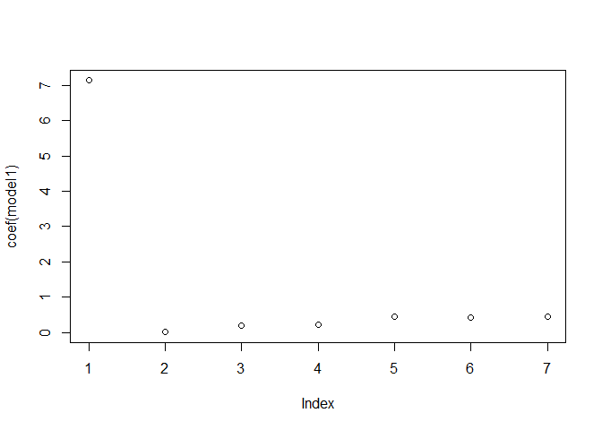<!-- -->

``` r
anova(model1)
```

    ## Analysis of Variance Table
    ## 
    ## Response: log(earn_wk)
    ##               Df  Sum Sq Mean Sq F value    Pr(>F)    
    ## Age            1    18.3  18.272  7.9948 0.0047042 ** 
    ## educ_hs        1    18.6  18.636  8.1543 0.0043082 ** 
    ## educ_smcoll    1    15.8  15.831  6.9269 0.0085093 ** 
    ## educ_as        1    13.8  13.841  6.0562 0.0138812 *  
    ## educ_bach      1    33.1  33.124 14.4936 0.0001418 ***
    ## educ_adv       1    38.7  38.748 16.9545 3.872e-05 ***
    ## Residuals   7142 16322.6   2.285                      
    ## ---
    ## Signif. codes:  0 '***' 0.001 '**' 0.01 '*' 0.05 '.' 0.1 ' ' 1

#### Model 1.1:

The group chosen are white workers from 25 to 64 years old, and paid by
the hour worked,the goal is to evaluate the earnings by the week as the
dependent variable, and age, race and educational attainments as
independent variables.

``` r
use_varb1.1 <- (Age>=25) & (Age<=64) & (White) & (PAIDHOUR == 2)
dat_use1.1<-subset(dat_CPS,use_varb1.1)
dim(dat_use1.1)
```

    ## [1] 40215    26

``` r
model1.1<-lm( log(earn_wk) ~ Age + educ_hs + educ_smcoll + educ_as + educ_bach + educ_adv, data=dat_use1.1) 
summary(model1.1)
```

    ## 
    ## Call:
    ## lm(formula = log(earn_wk) ~ Age + educ_hs + educ_smcoll + educ_as + 
    ##     educ_bach + educ_adv, data = dat_use1.1)
    ## 
    ## Residuals:
    ##    Min     1Q Median     3Q    Max 
    ## -7.513 -1.058 -0.470  1.774  2.157 
    ## 
    ## Coefficients:
    ##               Estimate Std. Error t value Pr(>|t|)    
    ## (Intercept)  7.8432826  0.0350410 223.831  < 2e-16 ***
    ## Age         -0.0092453  0.0006412 -14.418  < 2e-16 ***
    ## educ_hs     -0.1986637  0.0246476  -8.060 7.83e-16 ***
    ## educ_smcoll -0.1596985  0.0269328  -5.930 3.06e-09 ***
    ## educ_as     -0.0987006  0.0282791  -3.490 0.000483 ***
    ## educ_bach   -0.0685522  0.0273122  -2.510 0.012079 *  
    ## educ_adv     0.0159376  0.0374650   0.425 0.670548    
    ## ---
    ## Signif. codes:  0 '***' 0.001 '**' 0.01 '*' 0.05 '.' 0.1 ' ' 1
    ## 
    ## Residual standard error: 1.41 on 40208 degrees of freedom
    ## Multiple R-squared:  0.007853,   Adjusted R-squared:  0.007705 
    ## F-statistic: 53.04 on 6 and 40208 DF,  p-value: < 2.2e-16

``` r
coeftest(model1.1)
```

    ## 
    ## t test of coefficients:
    ## 
    ##                Estimate  Std. Error  t value  Pr(>|t|)    
    ## (Intercept)  7.84328264  0.03504105 223.8313 < 2.2e-16 ***
    ## Age         -0.00924533  0.00064125 -14.4178 < 2.2e-16 ***
    ## educ_hs     -0.19866374  0.02464761  -8.0602 7.828e-16 ***
    ## educ_smcoll -0.15969851  0.02693277  -5.9295 3.063e-09 ***
    ## educ_as     -0.09870056  0.02827909  -3.4902 0.0004831 ***
    ## educ_bach   -0.06855225  0.02731216  -2.5100 0.0120786 *  
    ## educ_adv     0.01593761  0.03746502   0.4254 0.6705476    
    ## ---
    ## Signif. codes:  0 '***' 0.001 '**' 0.01 '*' 0.05 '.' 0.1 ' ' 1

``` r
exp(model1.1$coefficients)
```

    ##  (Intercept)          Age      educ_hs  educ_smcoll      educ_as    educ_bach 
    ## 2548.5571247    0.9907973    0.8198255    0.8524007    0.9060140    0.9337447 
    ##     educ_adv 
    ##    1.0160653

``` r
plot(coef(model1.1))
```

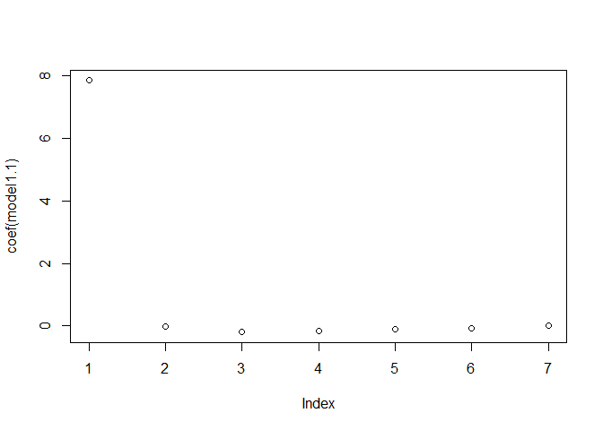<!-- -->

``` r
anova(model1.1)
```

    ## Analysis of Variance Table
    ## 
    ## Response: log(earn_wk)
    ##                Df Sum Sq Mean Sq  F value    Pr(>F)    
    ## Age             1    415  415.50 208.9562 < 2.2e-16 ***
    ## educ_hs         1    120  119.97  60.3328 8.200e-15 ***
    ## educ_smcoll     1     61   61.31  30.8346 2.828e-08 ***
    ## educ_as         1     17   17.49   8.7975  0.003018 ** 
    ## educ_bach       1     18   18.16   9.1325  0.002513 ** 
    ## educ_adv        1      0    0.36   0.1810  0.670548    
    ## Residuals   40208  79951    1.99                       
    ## ---
    ## Signif. codes:  0 '***' 0.001 '**' 0.01 '*' 0.05 '.' 0.1 ' ' 1

#### Model 2:

Comparing with log hour-wage: The group chosen are male black workers
from 25 to 64 years old, this new subset does not use the variable Paid
by the hour worked since the depended variable will be the hour wage,
and age, race and educational attainments as independent variables as
the first model.

``` r
use_varb2 <- (Age>=25) & (Age<=64) & (black) & male
dat_use2<-subset(dat_CPS,use_varb2)
dim(dat_use2)
```

    ## [1] 31172    26

``` r
model2<-lm( log(hour_wage) ~ Age + educ_hs + educ_smcoll + educ_as + educ_bach + educ_adv, data=dat_use2) 
summary(model2)
```

    ## 
    ## Call:
    ## lm(formula = log(hour_wage) ~ Age + educ_hs + educ_smcoll + educ_as + 
    ##     educ_bach + educ_adv, data = dat_use2)
    ## 
    ## Residuals:
    ##     Min      1Q  Median      3Q     Max 
    ## -5.9189  0.1765  0.2206  0.2683  0.3470 
    ## 
    ## Coefficients:
    ##               Estimate Std. Error t value Pr(>|t|)    
    ## (Intercept)  6.5517054  0.0268579 243.940  < 2e-16 ***
    ## Age          0.0035096  0.0004669   7.517 5.78e-14 ***
    ## educ_hs     -0.0459462  0.0179347  -2.562  0.01042 *  
    ## educ_smcoll -0.0786728  0.0198022  -3.973 7.12e-05 ***
    ## educ_as     -0.0434534  0.0237313  -1.831  0.06710 .  
    ## educ_bach    0.0321146  0.0209385   1.534  0.12510    
    ## educ_adv     0.0787525  0.0248772   3.166  0.00155 ** 
    ## ---
    ## Signif. codes:  0 '***' 0.001 '**' 0.01 '*' 0.05 '.' 0.1 ' ' 1
    ## 
    ## Residual standard error: 0.9448 on 31165 degrees of freedom
    ## Multiple R-squared:  0.004302,   Adjusted R-squared:  0.00411 
    ## F-statistic: 22.44 on 6 and 31165 DF,  p-value: < 2.2e-16

``` r
coeftest(model2)
```

    ## 
    ## t test of coefficients:
    ## 
    ##                Estimate  Std. Error  t value  Pr(>|t|)    
    ## (Intercept)  6.55170538  0.02685788 243.9398 < 2.2e-16 ***
    ## Age          0.00350959  0.00046692   7.5165 5.777e-14 ***
    ## educ_hs     -0.04594624  0.01793473  -2.5619  0.010416 *  
    ## educ_smcoll -0.07867279  0.01980219  -3.9729 7.115e-05 ***
    ## educ_as     -0.04345336  0.02373127  -1.8311  0.067101 .  
    ## educ_bach    0.03211464  0.02093848   1.5338  0.125098    
    ## educ_adv     0.07875247  0.02487724   3.1656  0.001549 ** 
    ## ---
    ## Signif. codes:  0 '***' 0.001 '**' 0.01 '*' 0.05 '.' 0.1 ' ' 1

``` r
exp(model2$coefficients)
```

    ## (Intercept)         Age     educ_hs educ_smcoll     educ_as   educ_bach 
    ## 700.4376709   1.0035158   0.9550933   0.9243423   0.9574772   1.0326359 
    ##    educ_adv 
    ##   1.0819365

``` r
plot(coef(model2))
```

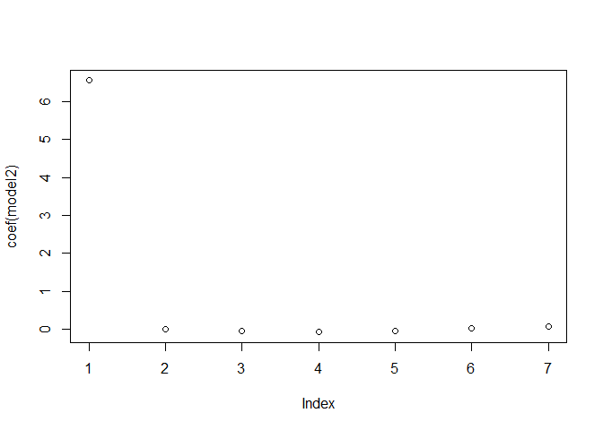<!-- -->

``` r
anova(model2)
```

    ## Analysis of Variance Table
    ## 
    ## Response: log(hour_wage)
    ##                Df  Sum Sq Mean Sq F value    Pr(>F)    
    ## Age             1    53.5  53.488 59.9197 1.018e-14 ***
    ## educ_hs         1     7.7   7.658  8.5788 0.0034035 ** 
    ## educ_smcoll     1    37.6  37.613 42.1358 8.643e-11 ***
    ## educ_as         1    12.5  12.485 13.9858 0.0001845 ***
    ## educ_bach       1     0.0   0.003  0.0029 0.9572708    
    ## educ_adv        1     8.9   8.946 10.0213 0.0015489 ** 
    ## Residuals   31165 27819.8   0.893                      
    ## ---
    ## Signif. codes:  0 '***' 0.001 '**' 0.01 '*' 0.05 '.' 0.1 ' ' 1

#### Model 2.2:

Comparing with log hour-wage: The group chosen are male white workers
from 25 to 64 years old, this new subset does not use the variable Paid
by the hour worked since the depended variable will be the hour wage,
and age, race and educational attainments as independent variables as
the model above.

``` r
use_varb2.2 <- (Age>=25) & (Age<=64) & (White) & male
dat_use2.2<-subset(dat_CPS,use_varb2.2)
dim(dat_use2.2)
```

    ## [1] 217818     26

``` r
model2.2<-lm( log(hour_wage) ~ Age + educ_hs + educ_smcoll + educ_as + educ_bach + educ_adv, data=dat_use2.2) 
summary(model2.2)
```

    ## 
    ## Call:
    ## lm(formula = log(hour_wage) ~ Age + educ_hs + educ_smcoll + educ_as + 
    ##     educ_bach + educ_adv, data = dat_use2.2)
    ## 
    ## Residuals:
    ##     Min      1Q  Median      3Q     Max 
    ## -6.8794  0.1435  0.2651  0.3172  0.3934 
    ## 
    ## Coefficients:
    ##              Estimate Std. Error t value Pr(>|t|)    
    ## (Intercept)  6.486376   0.010377 625.069  < 2e-16 ***
    ## Age          0.003376   0.000187  18.053  < 2e-16 ***
    ## educ_hs     -0.056432   0.007320  -7.709 1.27e-14 ***
    ## educ_smcoll -0.011557   0.008117  -1.424    0.154    
    ## educ_as     -0.037685   0.009052  -4.163 3.14e-05 ***
    ## educ_bach    0.115800   0.007689  15.061  < 2e-16 ***
    ## educ_adv     0.190461   0.008738  21.797  < 2e-16 ***
    ## ---
    ## Signif. codes:  0 '***' 0.001 '**' 0.01 '*' 0.05 '.' 0.1 ' ' 1
    ## 
    ## Residual standard error: 0.9696 on 217811 degrees of freedom
    ## Multiple R-squared:  0.009566,   Adjusted R-squared:  0.009539 
    ## F-statistic: 350.6 on 6 and 217811 DF,  p-value: < 2.2e-16

``` r
coeftest(model2.2)
```

    ## 
    ## t test of coefficients:
    ## 
    ##                Estimate  Std. Error  t value  Pr(>|t|)    
    ## (Intercept)  6.48637609  0.01037706 625.0689 < 2.2e-16 ***
    ## Age          0.00337632  0.00018702  18.0529 < 2.2e-16 ***
    ## educ_hs     -0.05643155  0.00731990  -7.7093  1.27e-14 ***
    ## educ_smcoll -0.01155723  0.00811694  -1.4238    0.1545    
    ## educ_as     -0.03768551  0.00905217  -4.1631  3.14e-05 ***
    ## educ_bach    0.11580018  0.00768885  15.0608 < 2.2e-16 ***
    ## educ_adv     0.19046109  0.00873782  21.7973 < 2.2e-16 ***
    ## ---
    ## Signif. codes:  0 '***' 0.001 '**' 0.01 '*' 0.05 '.' 0.1 ' ' 1

``` r
exp(model2.2$coefficients)
```

    ## (Intercept)         Age     educ_hs educ_smcoll     educ_as   educ_bach 
    ## 656.1412509   1.0033820   0.9451312   0.9885093   0.9630157   1.1227715 
    ##    educ_adv 
    ##   1.2098073

``` r
plot(coef(model2.2))
```

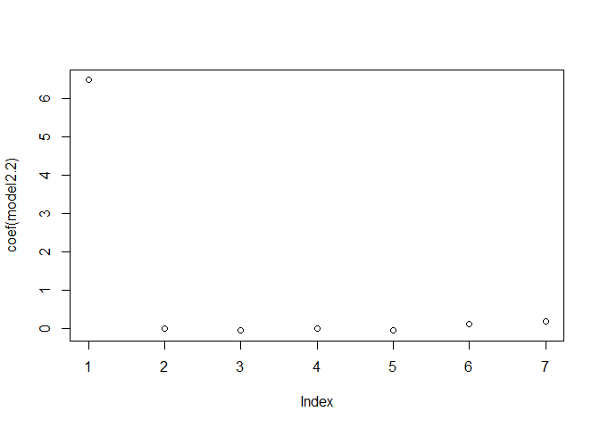<!-- -->

``` r
anova(model2.2)
```

    ## Analysis of Variance Table
    ## 
    ## Response: log(hour_wage)
    ##                 Df Sum Sq Mean Sq  F value    Pr(>F)    
    ## Age              1    323  323.48 344.1081 < 2.2e-16 ***
    ## educ_hs          1    604  604.05 642.5646 < 2.2e-16 ***
    ## educ_smcoll      1    225  224.68 239.0084 < 2.2e-16 ***
    ## educ_as          1    371  370.53 394.1542 < 2.2e-16 ***
    ## educ_bach        1      8    8.22   8.7415  0.003111 ** 
    ## educ_adv         1    447  446.65 475.1229 < 2.2e-16 ***
    ## Residuals   217811 204757    0.94                       
    ## ---
    ## Signif. codes:  0 '***' 0.001 '**' 0.01 '*' 0.05 '.' 0.1 ' ' 1

### Evaluation of previous models:

From previous models, it was possible to draw some valuable conclusions
on what variables and interactions might be interesting in adding on the
Oaxaca model. Models 2 and 2.2, given its higher number of observations
and differences in the significance levels of the age and educational
attainments variables, were chosen to further the investigation.

## Blind-Oaxaca Decomposition Models:

The Blind-Oaxaca decomposition method will be used to explain the wage
gap between white and black workers.

### Model A: Observations on educational attainments

Subset for the same age group as the base models, and adding males white
or black workers into the main subset.

``` r
use_varb.A <- (Age>=25) & (Age<=64) & (White | black) & male
dat_use.A <-subset(dat_CPS,use_varb.A)
```

``` r
dim(dat_use.A)
```

    ## [1] 248990     26

### Oaxaca Model 1: Wage differences and educational attainments

Start by decomposing the wage gap between black and white workers. The
wage gap could be due to age or educational attainments. The main
formula takes into consideration log hourly wages as the dependent
variable and age and educational attainments as dependent variables. The
boostrapped standard errors are calculated based on 100 replicates.

``` r
oaxaca_model <- oaxaca(log(hour_wage) ~ Age + educ_hs + educ_smcoll + educ_as + educ_bach + educ_adv |White| educ_hs + educ_smcoll + educ_as + educ_bach + educ_adv,data=dat_use.A, group.weights = NULL, R = 100)
```

    ## oaxaca: oaxaca() performing analysis. Please wait.

    ## 
    ## Bootstrapping standard errors:

    ## 1 / 100 (1%)

    ## 10 / 100 (10%)

    ## 20 / 100 (20%)

    ## 30 / 100 (30%)

    ## 40 / 100 (40%)

    ## 50 / 100 (50%)

    ## 60 / 100 (60%)

    ## 70 / 100 (70%)

    ## 80 / 100 (80%)

    ## 90 / 100 (90%)

    ## 100 / 100 (100%)

First observing the number of observations for each group to help in the
identification of who is in the group A and who belongs into the group
B. The summary points that group A corresponds to black workers and
group B to white workers, numbers observed in model 2 and 2.2
respectively. The n pooled represents the total of observations.

``` r
oaxaca_model$n
```

    ## $n.A
    ## [1] 31172
    ## 
    ## $n.B
    ## [1] 217818
    ## 
    ## $n.pooled
    ## [1] 248990

Following, the mean hourly wage for each group, where black workers
earns 0.022 cents more than white workers, although as observed before
the number of observations pooled for black workers were less than white
workers, which might have brought the unexpected return.

``` r
oaxaca_model$y
```

    ## $y.A
    ## [1] 6.682839
    ## 
    ## $y.B
    ## [1] 6.660117
    ## 
    ## $y.diff
    ## [1] 0.0227225

#### Threefold Blinder-Oaxaca

The threefold Blinder-Oaxaca decomposition suggests that approximately
0.017 cents can be attributed to group differences in age or education
(endowments), 0.03 due to differences in the coefficients and 0.008
cents can be accounted by the interaction of the two. In the plot it is
observed the estimation results for age and education attainments with
the error bars that indicate 95% confidence intervals.

``` r
oaxaca_model$threefold$overall
```

    ##   coef(endowments)     se(endowments) coef(coefficients)   se(coefficients) 
    ##      -0.0177289838       0.0007905682       0.0319937011       0.0057708901 
    ##  coef(interaction)    se(interaction) 
    ##       0.0084577825       0.0014321289

``` r
plot(oaxaca_model, components = c("endowments", "coefficients"))
```

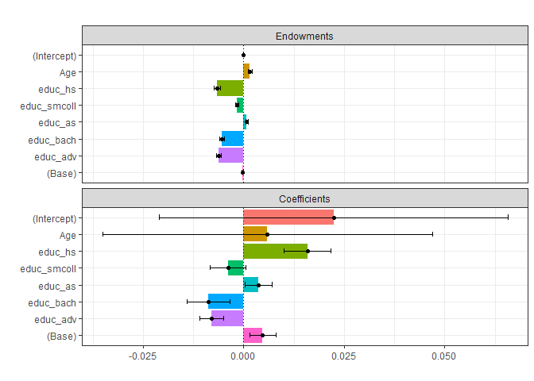<!-- -->

From the plot endowments only education in the bachelor, advanced degree
and high school seems statistically significant for the conclusion in
the wage gap differences, which is understandable given that higher
education attainments implies higher earnings across different
groups.From the summary bellow, we can see the differences in between
the education attainments:

``` r
summary(oaxaca_model$reg$reg.pooled.2)$coefficients["educ_hs",]
```

    ##      Estimate    Std. Error       t value      Pr(>|t|) 
    ## -5.424483e-02  6.778932e-03 -8.001972e+00  1.229630e-15

``` r
summary(oaxaca_model$reg$reg.pooled.2)$coefficients["educ_adv",]
```

    ##      Estimate    Std. Error       t value      Pr(>|t|) 
    ##  1.793120e-01  8.222618e-03  2.180716e+01 2.491456e-105

When analyzing differences in ages between white and black workers the
difference in earnings, it is not possible to find conclusive
information given that it is extremely low portion in the explanation of
the gap.

``` r
oaxaca_model$beta$beta.diff["Age"]
```

    ##          Age 
    ## 0.0001332713

#### Twofold decomposition

The twofold decomposition, points to consistent results with what was
observed on the threefold, here the difference in hourly payments is
still due to different educational attainments.

``` r
plot(oaxaca_model, decomposition = "twofold", group.weight = -1)
```

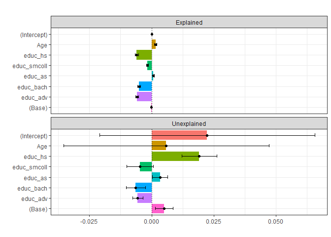<!-- -->
Confirming the trend above observed, educational attainments, and
specifically high school education is the main driver on the wage gap
between both groups.

``` r
plot(oaxaca_model, decomposition = "twofold", group.weight = -1, unexplained.split = TRUE, components = c("unexplained A","unexplained B"), component.labels = c("unexplained A" = "black workers", "unexplained B" = "white workers"), variables = c("Age", "educ_hs", "educ_smcoll", "educ_as", "educ_bach", "educ_adv"), variable.labels = c("AGE" = "age", "EDUC" = "educ_hs", "educ_smcoll", "educ_as", "educ_bach", "educ_adv"))
```

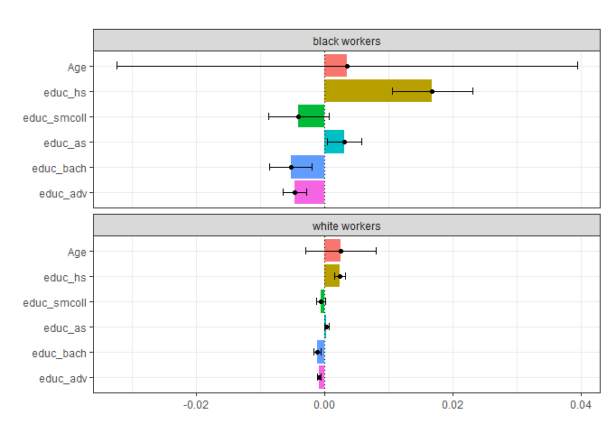<!-- -->

The unexplained portion on the twofold decomposition, when comparing the
variables and the races, still holds the differences in the high school
level.

``` r
plot(oaxaca_model, decomposition = "twofold", group.weight = -1, unexplained.split = TRUE, components = c("unexplained A","unexplained B"), component.labels = c("unexplained A" = "black workers" , "unexplained B" = "white workers"), component.left = TRUE, variables = c("Age", "educ_hs", "educ_smcoll", "educ_as", "educ_bach", "educ_adv"), variable.labels = c("AGE" = "age", "EDUC" = "educ_hs", "educ_smcoll", "educ_as", "educ_bach", "educ_adv"))
```

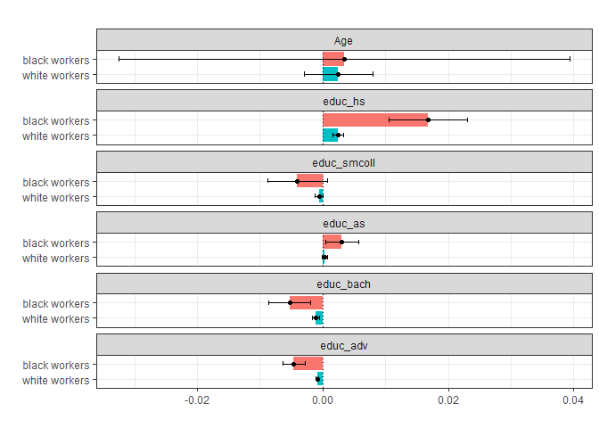<!-- -->

### Oaxaca Model 2: Additional observations for employees that workes on private sector and live in the city

The new subset takes into consideration only workers in the private
sector that lives in the city, in this subset there is a lower number of
observations.

``` r
use_varb.B <- (Age>=25) & (Age<=64) & (White | black) & male & city & empl_pvt
dat_use.B <-subset(dat_CPS,use_varb.B)
```

Adding marital status in the model:

``` r
oaxaca_model1 <- oaxaca(log(hour_wage) ~ Age + married + educ_hs + educ_smcoll + educ_as + educ_bach + educ_adv |White,data=dat_use.B, group.weights = NULL, R = 100)
```

    ## oaxaca: oaxaca() performing analysis. Please wait.

    ## 
    ## Bootstrapping standard errors:

    ## 1 / 100 (1%)

    ## 10 / 100 (10%)

    ## 20 / 100 (20%)

    ## 30 / 100 (30%)

    ## 40 / 100 (40%)

    ## 50 / 100 (50%)

    ## 60 / 100 (60%)

    ## 70 / 100 (70%)

    ## 80 / 100 (80%)

    ## 90 / 100 (90%)

    ## 100 / 100 (100%)

In the same way the number of black workers is smaller than white
workers, although the difference in earnings is higher and the white
workers earn more than the black employees.

``` r
oaxaca_model1$n
```

    ## $n.A
    ## [1] 7230
    ## 
    ## $n.B
    ## [1] 33537
    ## 
    ## $n.pooled
    ## [1] 40767

``` r
oaxaca_model1$y
```

    ## $y.A
    ## [1] 6.582412
    ## 
    ## $y.B
    ## [1] 6.60681
    ## 
    ## $y.diff
    ## [1] -0.02439804

``` r
oaxaca_model1$threefold$overall
```

    ##   coef(endowments)     se(endowments) coef(coefficients)   se(coefficients) 
    ##       -0.051832955        0.003912809        0.012808290        0.014922768 
    ##  coef(interaction)    se(interaction) 
    ##        0.014626623        0.007632778

Differently from the first model the threefold decomposition suggests
that approximately 0.05 cents can be attributed to group differences in
age, education or marital status (endowments), 0.012 due to differences
in the coefficients and 0.014 cents can be accounted by the interaction
of the two. In the plot it is observed the estimation results for age
and education attainments with the error bars that indicate 95%
confidence intervals.

``` r
plot(oaxaca_model1, components = c("endowments", "coefficients"))
```

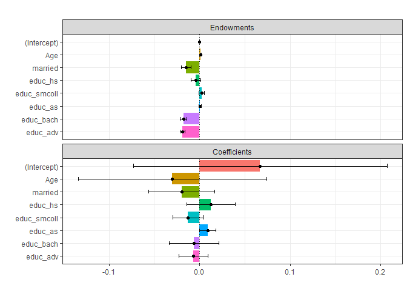<!-- --> In
the endowments plot marital status and advanced educational attainments
have a higher level of significance than the first model, probably due
to the fact that the private sector is more selective in the higher
education.

#### Twofold decomposition

The twofold decomposition, points to different results from the
threefold because Age is more significant than the other variables.

``` r
plot(oaxaca_model1, decomposition = "twofold", group.weight = -1, unexplained.split = TRUE, components = c("unexplained A","unexplained B"), component.labels = c("unexplained A" = "black workers", "unexplained B" = "white workers"), variables = c("Age", "married", "educ_hs", "educ_smcoll", "educ_as", "educ_bach", "educ_adv"), variable.labels = c("AGE" = "age", "MARST" = "married", "EDUC" = "educ_hs", "educ_smcoll", "educ_as", "educ_bach", "educ_adv"))
```

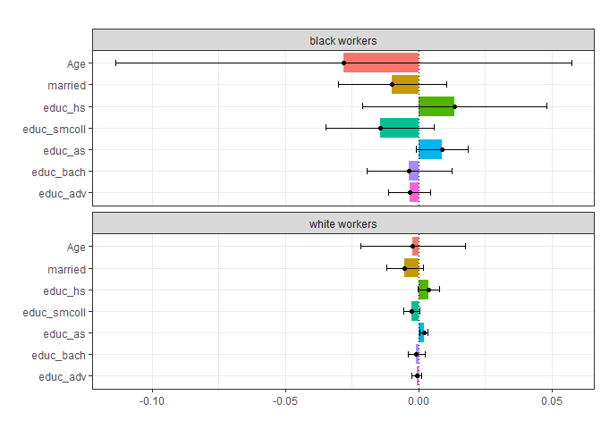<!-- --> By
variable comparison:

``` r
plot(oaxaca_model1, decomposition = "twofold", group.weight = -1, unexplained.split = TRUE, components = c("unexplained A","unexplained B"), component.labels = c("unexplained A" = "black workers" , "unexplained B" = "white workers"), component.left = TRUE, variables = c("Age", "married", "educ_hs", "educ_smcoll", "educ_as", "educ_bach", "educ_adv"), variable.labels = c("AGE" = "age", "MARST" = "married", "EDUC" = "educ_hs", "educ_smcoll", "educ_as", "educ_bach", "educ_adv"))
```

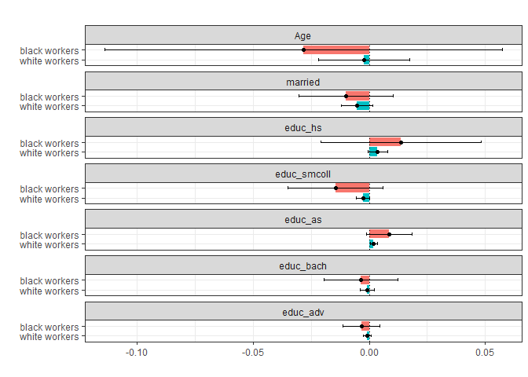<!-- -->
